<div align="center">

# It's Weber Tools

**163 local tools — Crypto, Converter, Network, Docker, Images and more.**  
Runs anywhere Docker runs. No cloud, no login, no telemetry. Everything stays in your browser.

[](LICENSE)
[](#quick-start)
[](#tool-categories)
[](https://itsweber.de)

[Quick Start](#quick-start) · [Tool Categories](#tool-categories) · [Pipes](#pipes) · [Architecture](#architecture) · [Development](#development)

🇩🇪 **Auf Deutsch lesen** → [README.de.md](README.de.md)

</div>

---

## Screenshots

<details open>
<summary><strong>Hub — Discovery & Navigation</strong></summary>

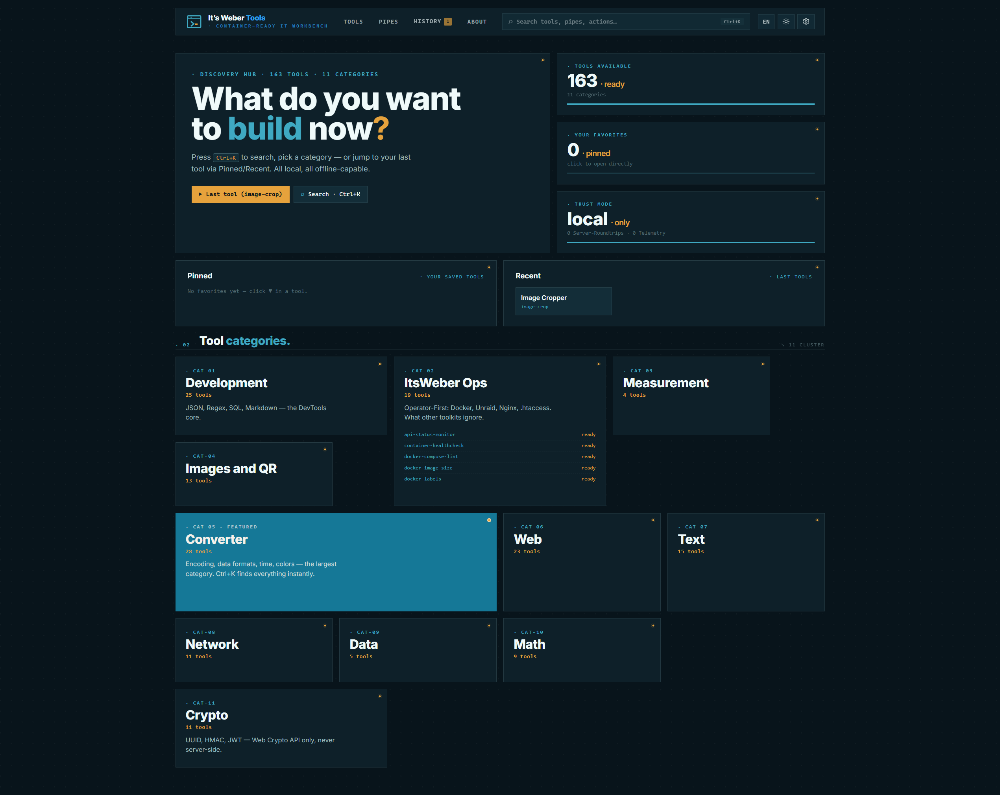
*Hub — all 163 tools by category, Pinned & Recent sections, keyboard-first navigation.*

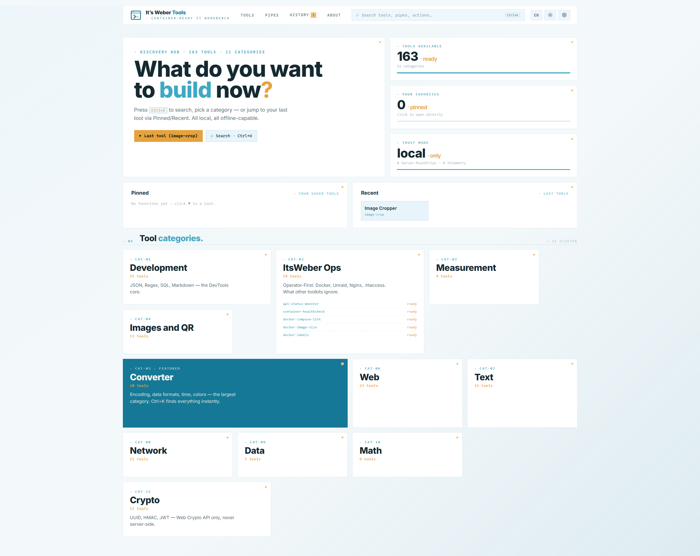
*Light mode — same layout, full contrast, no eye strain.*

</details>

<details>
<summary><strong>Tools — Browse & Workbench</strong></summary>

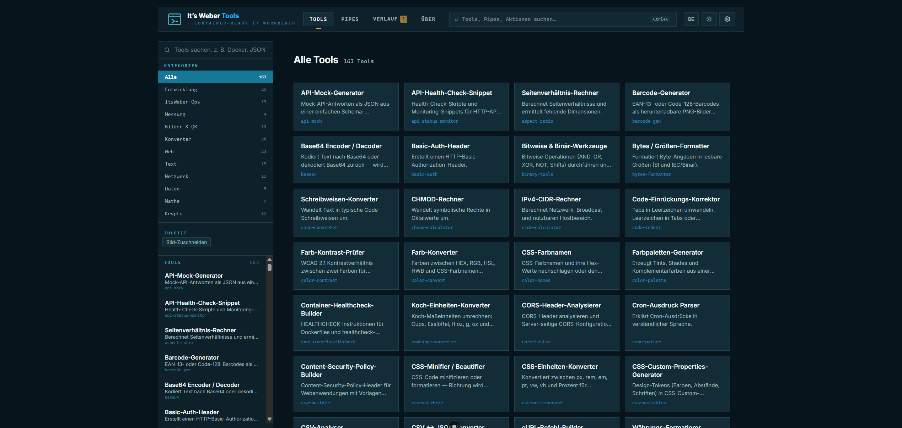
*All 163 tools in one grid — searchable, filterable by category.*

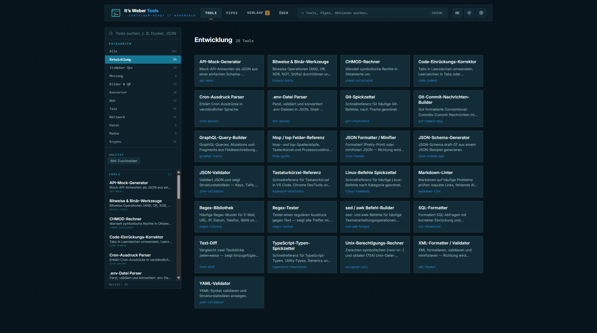
*Development — 25 tools including JSON, Regex, SQL, Docker, Markdown.*

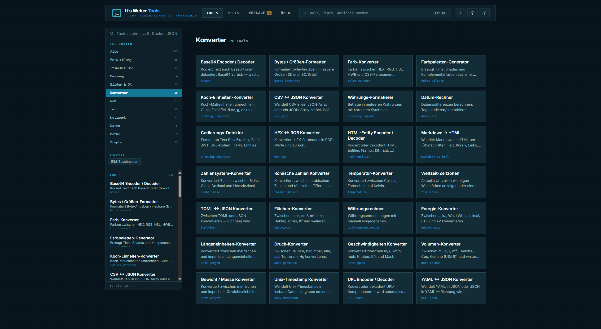
*Converter — 34 tools, the largest category. Ctrl-S finds everything instantly.*

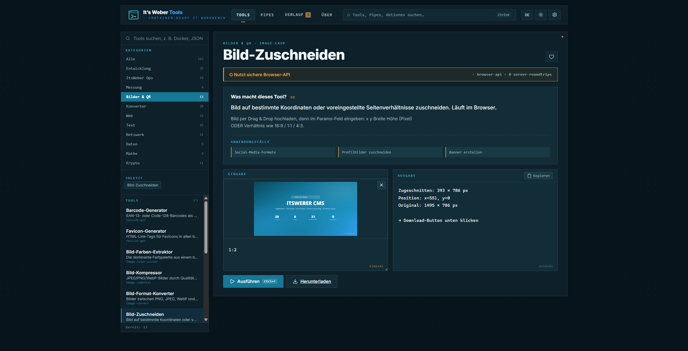
*Workbench — drag-and-drop image tools with live preview and download.*

</details>

<details>
<summary><strong>Pipes — Tool chaining</strong></summary>

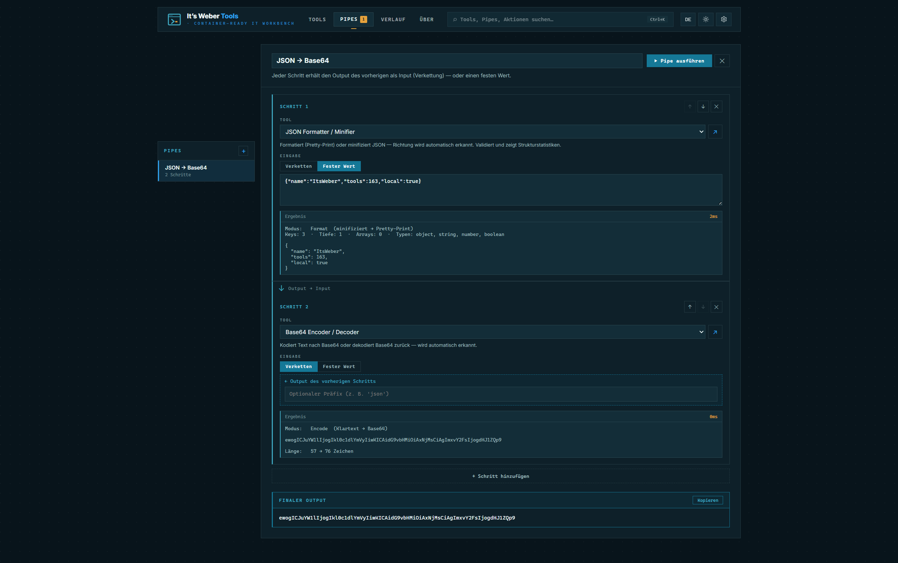
*Pipe in action — JSON Formatter → Base64 Encoder, inline results, clean final output.*

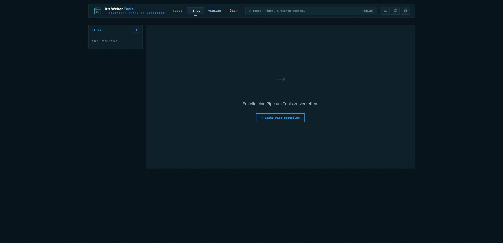
*Pipes page — create reusable multi-step workflows.*

</details>

<details>
<summary><strong>Command Palette & Settings</strong></summary>

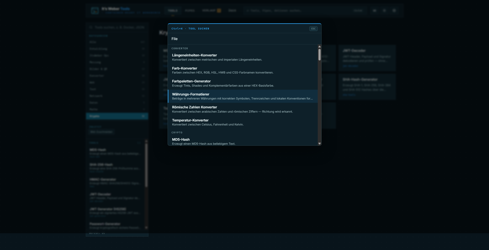
*Ctrl + K — fuzzy search across all tools, pipes and actions.*

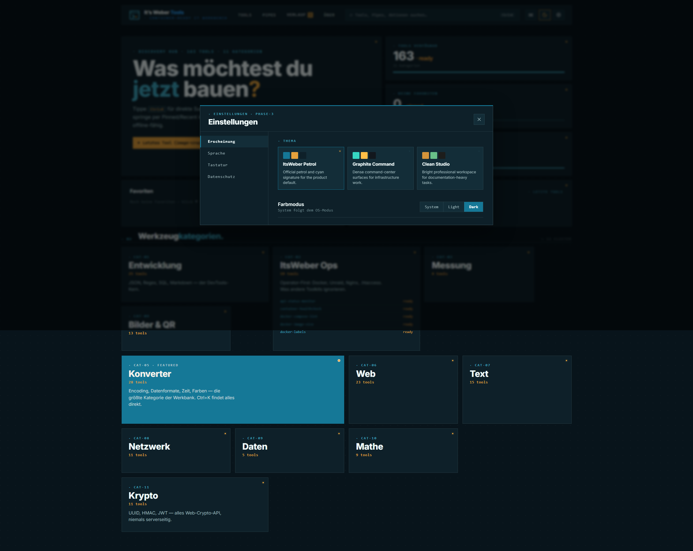
*Settings: three themes — ItsWeber Petrol, Graphite Command, Clean Studio.*

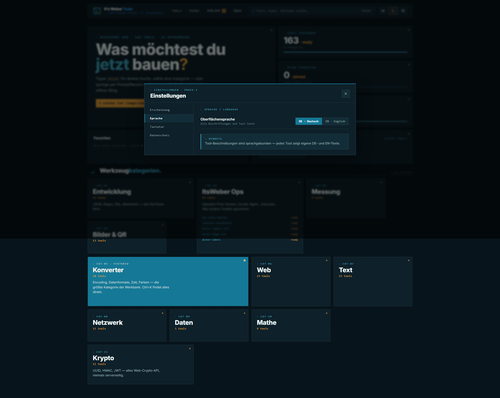
*Settings: DE / EN toggle — all tool descriptions switch language.*

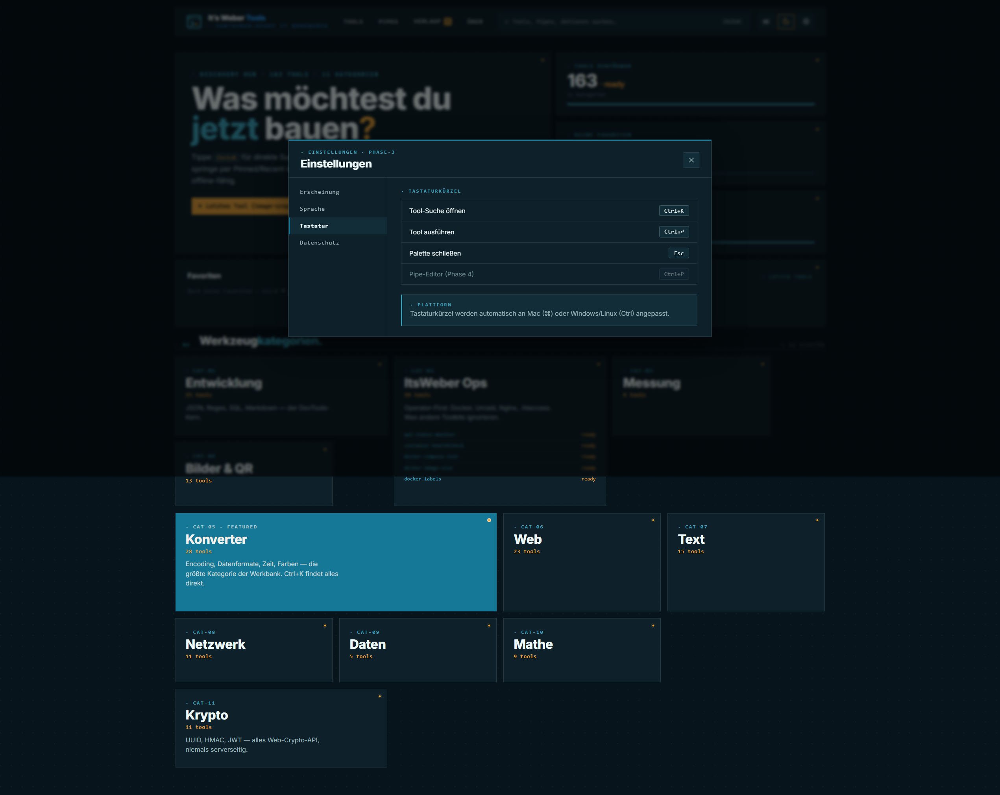
*Settings: all keyboard shortcuts — Mac (⌘) and Windows (Ctrl) auto-detected.*

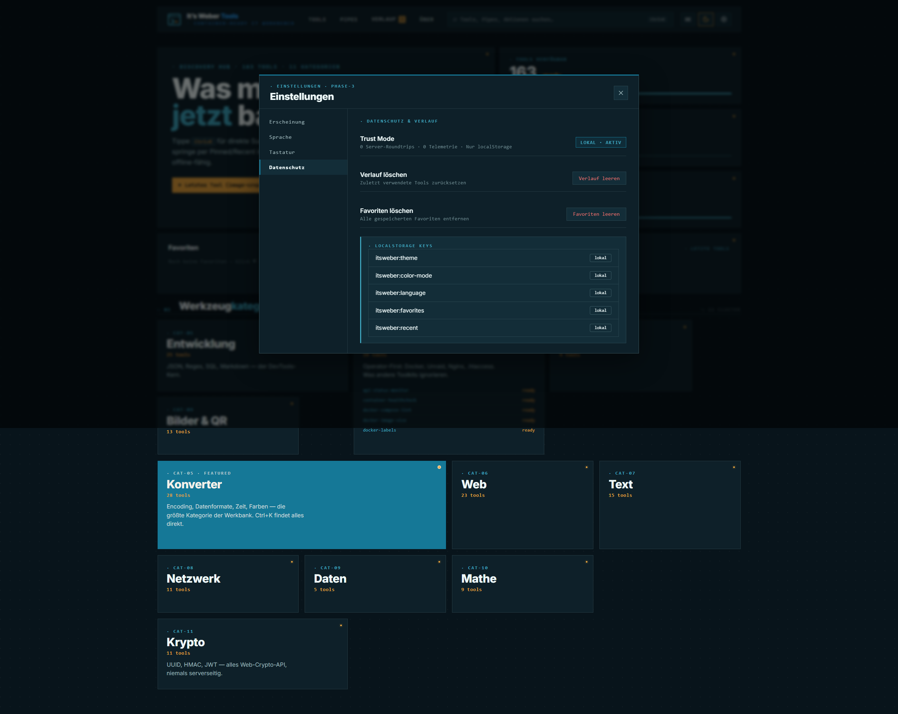
*Settings: Trust Mode, clear history, clear favourites, localStorage export.*

</details>

---

## Features

- **163 ready tools** across 11 categories — all run locally in the browser, zero server calls for most operations
- **Pipe system** — chain tools together: output of step N becomes input of step N+1; static inputs and prefix injection supported
- **Execution history** — last 100 runs stored in localStorage, one-click rerun
- **Command palette** (Ctrl + K) — fuzzy search tools, pipes and actions; keyboard-first navigation
- **Bilingual** — full German / English UI, switches without reload
- **Dark / Light mode** — system-default auto-detection, persists across sessions
- **Image tools** — drag-and-drop upload for resize, crop, compress, convert, flip, metadata, color picker, QR generator, favicon generator
- **Privacy-first** — no analytics, no external fonts or CDNs in production, no accounts
- **Single Docker container** — nginx-based, ~10 MB image, non-root user, security headers including CSP
- **PWA** — installable, service worker for offline use of cached assets

---

## Quick Start

### Docker (recommended)

```bash
docker run -d \
  --name itsweber-tools \
  --restart unless-stopped \
  -p 8080:80 \
  --security-opt no-new-privileges:true \
  ghcr.io/itsweber-official/itsweber-tools:latest
```

Open [http://localhost:8080](http://localhost:8080).

### docker-compose

```yaml
services:
  itsweber-tools:
    image: ghcr.io/itsweber-official/itsweber-tools:latest
    container_name: itsweber-tools
    restart: unless-stopped
    ports:
      - "8080:80"
    security_opt:
      - no-new-privileges:true
```

### From source

```bash
git clone https://github.com/itsweber-official/itsweber-tools.git
cd itsweber-tools
pnpm install
pnpm dev          # http://localhost:5173
```

Build a Docker image: `docker build -f docker/Dockerfile -t itsweber-tools:dev .`

---

## Tool Categories

| Category | Count | Examples |
|---|---|---|
| **Crypto** | 12 | SHA-256/MD5/HMAC, PBKDF2, bcrypt, AES, JWT generate/parse/decode, htpasswd |
| **Converter** | 24 | Base64, Hex↔RGB, URL codec, HTML entities, Roman numerals, number base, temperature, CSV↔JSON, YAML↔JSON, TOML↔JSON |
| **Development** | 28 | JSON format/minify/validate/query/schema, regex tester, cron parser, SQL formatter, env formatter/parser, string escape, Docker run→compose, diff |
| **Network** | 18 | CIDR/subnet calc, IP info/geo, DNS lookup, port lookup, MAC lookup, IPv4 range, UFW rules, nginx config, ssh-keygen guide, CORS tester |
| **Images and QR** | 12 | QR generator, favicon generator, image resize/crop/compress/convert/flip/metadata/color-picker/to-base64/to-PDF |
| **Text** | 18 | Word counter, lorem ipsum, text case, line tools, text diff, markdown↔HTML, markdown lint, text wrap, template, slugify |
| **Data** | 10 | CSV analyzer, JSON query, table format, docker ps formatter, docker image size, IBAN validator, open graph, meta tags, statistics |
| **Math** | 12 | Math eval, percentage, GCD/LCM, Fibonacci, prime checker, number format, statistics |
| **Measurement** | 14 | Unit converters — length, weight, area, volume, pressure, energy, speed, data size, aspect ratio, CSS units, bytes formatter |
| **Web** | 8 | URL/URI parser, HTTP status codes, basic auth, API status monitor, color palette, color contrast, color convert, color names |
| **ItsWeber Ops** | 7 | Docker run→compose, docker-compose lint, Unraid template helper, nginx config builder, UFW rules, ssh-keygen guide, htpasswd |

Full catalog: [docs/TOOL_CATALOG.md](docs/TOOL_CATALOG.md)

---

## Pipes

The Pipes system lets you chain tools together into reusable workflows:

```
[JSON Formatter] → pretty-printed JSON
       ↓
[Base64 Encoder] → Base64 of the JSON
       ↓
[SHA-256 Hash]   → hash of the Base64 string
```

Each step can use the previous step's output (chain mode) or a fixed static value. An optional prefix can be prepended before chaining. The final output panel shows the clean result ready to copy — without any metadata headers from intermediate tools.

---

## Architecture

| Layer | Technology |
|---|---|
| Framework | React 19, TypeScript 5.9 strict |
| Build | Vite 7, pnpm workspaces |
| Packages | `@itsweber/toolkit` (tool engine + 163 tools), `@itsweber/ui` (theme tokens) |
| Tool engine | `defineTool()` registry, one file per tool, auto-discovery via `import.meta.glob` |
| State | React `useState` + `useLocalStorage` (theme, language, history, pipes, favourites) |
| Container | nginx 1.27 Alpine, multi-stage build, non-root user, CSP/security headers |
| Tests | Vitest 4 — registry completeness, no duplicate IDs, tool execution |

Adding a new tool = one TypeScript file + `defineTool()`. No registration step required.

---

## Development

```bash
pnpm install
pnpm dev              # Vite dev server at http://localhost:5173
pnpm lint             # ESLint v9
pnpm typecheck        # tsc --noEmit
pnpm test             # Vitest
pnpm build            # Production build
pnpm format           # Prettier
```

### Adding a tool

Create `packages/toolkit/src/tools/<id>.ts`:

```ts
import { defineTool } from "../core";

export default defineTool({
  id: "my-tool",
  title: "My Tool",
  titleDe: "Mein Tool",
  description: "What it does in one sentence.",
  descriptionDe: "Was es tut in einem Satz.",
  explanation: "Longer usage explanation with example.",
  explanationDe: "Längere Nutzungserklärung mit Beispiel.",
  category: "Converter",
  keywords: ["keyword1", "keyword2"],
  status: "ready",
  privacyMode: "local-only",
  placeholder: "Input placeholder text",
  example: "example input value",
  useCases: ["Use case 1", "Use case 2"],
  useCasesDe: ["Anwendungsfall 1", "Anwendungsfall 2"],
  run: (input) => ({ output: input.toUpperCase() }),
});
```

Auto-discovered via `import.meta.glob` — no registration needed. Add a test entry in `packages/toolkit/src/registry.test.ts`.

---

## Roadmap

- [x] v0.1 — Initial scaffold, brand identity (Petrol + Brass, Direction B logo)
- [x] v0.2 — 163 tools, Pipes system, History, Docker hardening, PWA, bilingual UI
- [ ] v0.3 — Operator themes (dark variants), settings panel, keyboard shortcut customisation
- [ ] v0.4 — GitHub CI/CD (typecheck + test on PR, GHCR image on tag)
- [ ] v1.0 — 200 tools, Unraid Community App listing

---

## License

See [LICENSE](LICENSE) — source is publicly visible for distribution and Docker-based deployment.

---

Built by **[ITSWEBER](https://itsweber.de)** · Issues and PRs welcome → [CONTRIBUTING.md](CONTRIBUTING.md)
